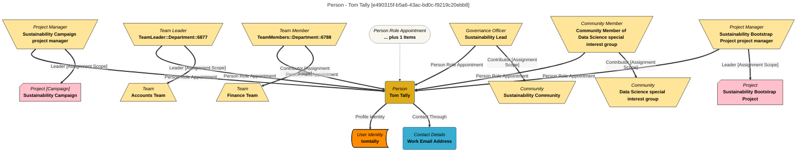

```mermaid
---
title: Person - Tom Tally [e490315f-b5a6-43ac-bd0c-f9219c20ebb8]
---
flowchart TD
%%{init: {"flowchart": {"htmlLabels": false}} }%%

1@{ shape: rounded, label: "*Person*
**Tom Tally**"}
2@{ shape: bow-rect, label: "*User Identity*
**tomtally**"}
1==>|"Profile Identity"|2
3@{ shape: rounded, label: "*Contact Details*
**Work Email Address**"}
1==>|"Contact Through"|3
4@{ shape: trap-t, label: "*Project Manager*
**Sustainability Campaign project manager**"}
4==>|"Person Role Appointment"|1
5@{ shape: notch-rect, label: "*Project [Campaign]*
**Sustainability Campaign**"}
4==>|"Leader [Assignment Scope]"|5
6@{ shape: trap-t, label: "*Team Leader*
**TeamLeader::Department::6877**"}
6==>|"Person Role Appointment"|1
7@{ shape: trap-b, label: "*Team*
**Accounts Team**"}
6==>|"Leader [Assignment Scope]"|7
8@{ shape: trap-t, label: "*Team Member*
**TeamMembers::Department::6788**"}
8==>|"Person Role Appointment"|1
9@{ shape: trap-b, label: "*Team*
**Finance Team**"}
8==>|"Contributor [Assignment Scope]"|9
10@{ shape: trap-t, label: "*Governance Officer*
**Sustainability Lead**"}
10==>|"Person Role Appointment"|1
11@{ shape: trap-t, label: "*Community*
**Sustainability Community**"}
10==>|"Contributor [Assignment Scope]"|11
12@{ shape: trap-t, label: "*Community Member*
**Community Member of Data Science special interest group**"}
12==>|"Person Role Appointment"|1
13@{ shape: trap-t, label: "*Community*
**Data Science special interest group**"}
12==>|"Contributor [Assignment Scope]"|13
14@{ shape: trap-t, label: "*Project Manager*
**Sustainability Bootstrap Project project manager**"}
14==>|"Person Role Appointment"|1
15@{ shape: notch-rect, label: "*Project*
**Sustainability Bootstrap Project**"}
14==>|"Leader [Assignment Scope]"|15
16@{ shape: stadium, label: "*Person Role Appointment*
**... plus 1 Items**"}
16-.->1
style 11 color:#000000, fill:#FFE599, stroke:#000000
style 12 color:#000000, fill:#FFE599, stroke:#000000
style 13 color:#000000, fill:#FFE599, stroke:#000000
style 14 color:#000000, fill:#FFE599, stroke:#000000
style 15 color:#000000, fill:#FFC0CB, stroke:#000000
style 16 color:#000000, fill:#F9F7ED, stroke:#b7c0c7
style 1 color:#000000, fill:#e0ab18, stroke:#004563
style 2 color:#000000, fill:#FF8C00, stroke:#000000
style 3 color:#000000, fill:#39add1, stroke:#004563
style 4 color:#000000, fill:#FFE599, stroke:#000000
style 5 color:#000000, fill:#FFC0CB, stroke:#000000
style 6 color:#000000, fill:#FFE599, stroke:#000000
style 7 color:#000000, fill:#FFE599, stroke:#000000
style 8 color:#000000, fill:#FFE599, stroke:#000000
style 9 color:#000000, fill:#FFE599, stroke:#000000
style 10 color:#000000, fill:#FFE599, stroke:#000000
```
