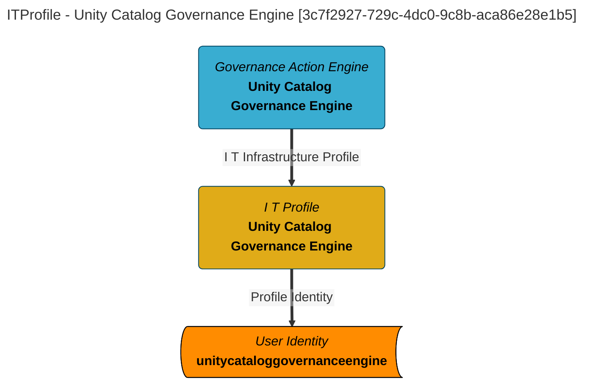

```mermaid
---
title: ITProfile - Unity Catalog Governance Engine [3c7f2927-729c-4dc0-9c8b-aca86e28e1b5]
---
flowchart TD
%%{init: {"flowchart": {"htmlLabels": false}} }%%

1@{ shape: rounded, label: "*I T Profile*
**Unity Catalog Governance Engine**"}
2@{ shape: bow-rect, label: "*User Identity*
**unitycataloggovernanceengine**"}
1==>|"Profile Identity"|2
3@{ shape: rounded, label: "*Governance Action Engine*
**Unity Catalog Governance Engine**"}
3==>|"I T Infrastructure Profile"|1
style 1 color:#000000, fill:#e0ab18, stroke:#004563
style 2 color:#000000, fill:#FF8C00, stroke:#000000
style 3 color:#000000, fill:#39add1, stroke:#004563
```
> Unity Catalog Governance Engine: Provides specialist governance services to Unity Catalog (UC) servers. (Extracted from 6.0-SNAPSHOT)
