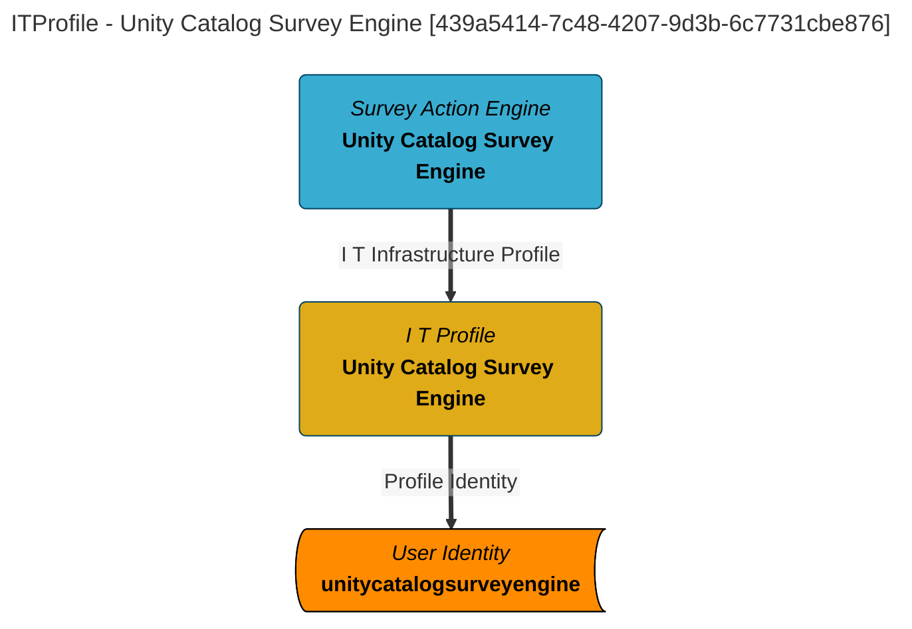

```mermaid
---
title: ITProfile - Unity Catalog Survey Engine [439a5414-7c48-4207-9d3b-6c7731cbe876]
---
flowchart TD
%%{init: {"flowchart": {"htmlLabels": false}} }%%

1@{ shape: rounded, label: "*I T Profile*
**Unity Catalog Survey Engine**"}
2@{ shape: bow-rect, label: "*User Identity*
**unitycatalogsurveyengine**"}
1==>|"Profile Identity"|2
3@{ shape: rounded, label: "*Survey Action Engine*
**Unity Catalog Survey Engine**"}
3==>|"I T Infrastructure Profile"|1
style 1 color:#000000, fill:#e0ab18, stroke:#004563
style 2 color:#000000, fill:#FF8C00, stroke:#000000
style 3 color:#000000, fill:#39add1, stroke:#004563
```
> Unity Catalog Survey Engine: Provides specialist surveys on Unity Catalog (UC) servers. (Extracted from 6.0-SNAPSHOT)
