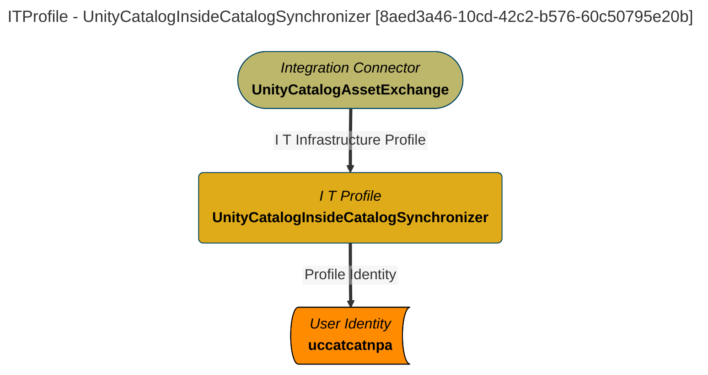

> UnityCatalogInsideCatalogSynchronizer: Synchronizes metadata information about the contents of catalogs found in the OSS Unity Catalog ''catalog of catalogs'' with the open metadata ecosystem. (Extracted from 6.0-SNAPSHOT)
