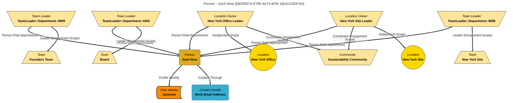

```mermaid
---
title: Person - Zach Now [b829567e-6795-4e74-af7b-18e2c22847d4]
---
flowchart TD
%%{init: {"flowchart": {"htmlLabels": false}} }%%

1@{ shape: rounded, label: "*Person*
**Zach Now**"}
2@{ shape: bow-rect, label: "*User Identity*
**zachnow**"}
1==>|"Profile Identity"|2
3@{ shape: rounded, label: "*Contact Details*
**Work Email Address**"}
1==>|"Contact Through"|3
4@{ shape: trap-t, label: "*Team Leader*
**TeamLeader::Department::9999**"}
4==>|"Person Role Appointment"|1
5@{ shape: trap-b, label: "*Team*
**Founders Team**"}
4==>|"Leader [Assignment Scope]"|5
6@{ shape: trap-t, label: "*Team Leader*
**TeamLeader::Department::4302**"}
6==>|"Person Role Appointment"|1
7@{ shape: trap-b, label: "*Team*
**Board**"}
6==>|"Leader [Assignment Scope]"|7
8@{ shape: trap-t, label: "*Location Owner*
**New York Office Leader**"}
8==>|"Person Role Appointment"|1
9@{ shape: circle, label: "*Location*
**New York Office**"}
8==>|"Assignment Scope"|9
10@{ shape: trap-t, label: "*Community*
**Sustainability Community**"}
8==>|"Contributor [Assignment Scope]"|10
11@{ shape: trap-t, label: "*Location Owner*
**New York Site Leader**"}
11==>|"Person Role Appointment"|1
11==>|"Contributor [Assignment Scope]"|10
12@{ shape: circle, label: "*Location*
**New York Site**"}
11==>|"Assignment Scope"|12
13@{ shape: trap-t, label: "*Team Leader*
**TeamLeader::Department::9996**"}
13==>|"Person Role Appointment"|1
14@{ shape: trap-b, label: "*Team*
**New York Site**"}
13==>|"Leader [Assignment Scope]"|14
style 11 color:#000000, fill:#FFE599, stroke:#000000
style 12 color:#000000, fill:#FFD700, stroke:#000000
style 13 color:#000000, fill:#FFE599, stroke:#000000
style 14 color:#000000, fill:#FFE599, stroke:#000000
style 1 color:#000000, fill:#e0ab18, stroke:#004563
style 2 color:#000000, fill:#FF8C00, stroke:#000000
style 3 color:#000000, fill:#39add1, stroke:#004563
style 4 color:#000000, fill:#FFE599, stroke:#000000
style 5 color:#000000, fill:#FFE599, stroke:#000000
style 6 color:#000000, fill:#FFE599, stroke:#000000
style 7 color:#000000, fill:#FFE599, stroke:#000000
style 8 color:#000000, fill:#FFE599, stroke:#000000
style 9 color:#000000, fill:#FFD700, stroke:#000000
style 10 color:#000000, fill:#FFE599, stroke:#000000
```
