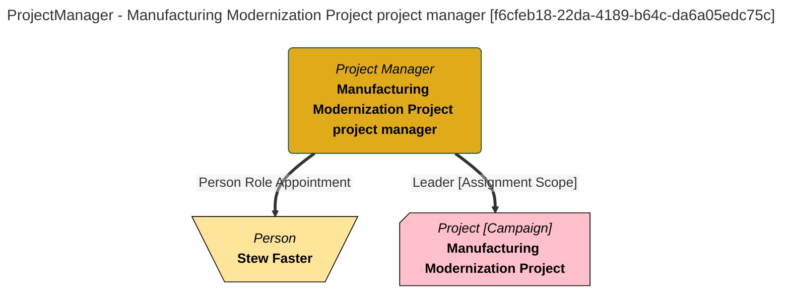

```mermaid
---
title: ProjectManager - Manufacturing Modernization Project project manager [f6cfeb18-22da-4189-b64c-da6a05edc75c]
---
flowchart TD
%%{init: {"flowchart": {"htmlLabels": false}} }%%

1@{ shape: rounded, label: "*Project Manager*
**Manufacturing Modernization Project project manager**"}
2@{ shape: trap-t, label: "*Person*
**Stew Faster**"}
1==>|"Person Role Appointment"|2
3@{ shape: notch-rect, label: "*Project [Campaign]*
**Manufacturing Modernization Project**"}
1==>|"Leader [Assignment Scope]"|3
style 1 color:#000000, fill:#e0ab18, stroke:#004563
style 2 color:#000000, fill:#FFE599, stroke:#000000
style 3 color:#000000, fill:#FFC0CB, stroke:#000000
```
