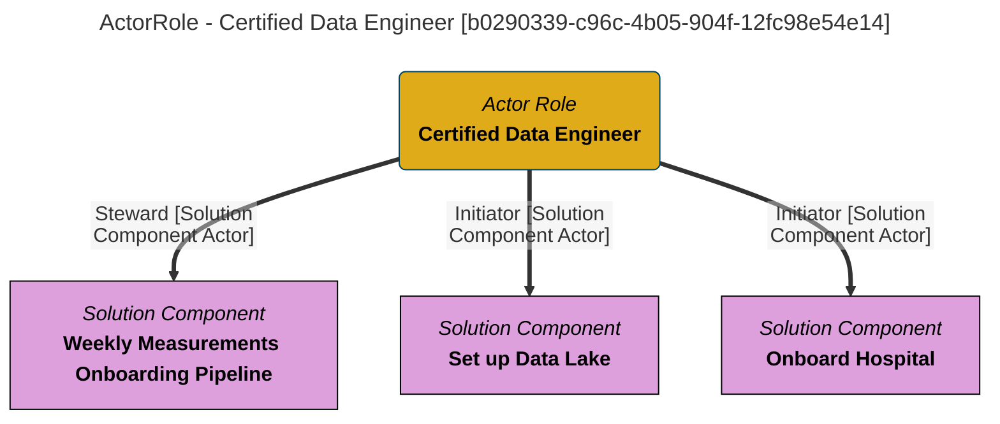

```mermaid
---
title: ActorRole - Certified Data Engineer [b0290339-c96c-4b05-904f-12fc98e54e14]
---
flowchart TD
%%{init: {"flowchart": {"htmlLabels": false}} }%%

1@{ shape: rounded, label: "*Actor Role*
**Certified Data Engineer**"}
2@{ shape: rect, label: "*Solution Component*
**Weekly Measurements Onboarding Pipeline**"}
1==>|"Steward [Solution Component Actor]"|2
3@{ shape: rect, label: "*Solution Component*
**Set up Data Lake**"}
1==>|"Initiator [Solution Component Actor]"|3
4@{ shape: rect, label: "*Solution Component*
**Onboard Hospital**"}
1==>|"Initiator [Solution Component Actor]"|4
style 1 color:#000000, fill:#e0ab18, stroke:#004563
style 2 color:#000000, fill:#DDA0DD, stroke:#000000
style 3 color:#000000, fill:#DDA0DD, stroke:#000000
style 4 color:#000000, fill:#DDA0DD, stroke:#000000
```
