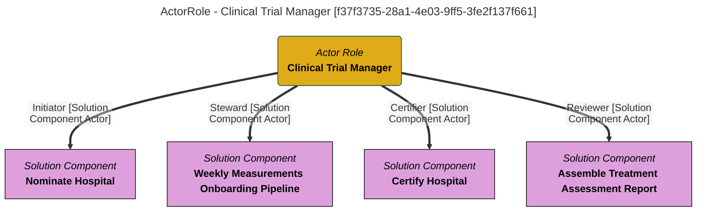

```mermaid
---
title: ActorRole - Clinical Trial Manager [f37f3735-28a1-4e03-9ff5-3fe2f137f661]
---
flowchart TD
%%{init: {"flowchart": {"htmlLabels": false}} }%%

1@{ shape: rounded, label: "*Actor Role*
**Clinical Trial Manager**"}
2@{ shape: rect, label: "*Solution Component*
**Nominate Hospital**"}
1==>|"Initiator [Solution Component Actor]"|2
3@{ shape: rect, label: "*Solution Component*
**Weekly Measurements Onboarding Pipeline**"}
1==>|"Steward [Solution Component Actor]"|3
4@{ shape: rect, label: "*Solution Component*
**Certify Hospital**"}
1==>|"Certifier [Solution Component Actor]"|4
5@{ shape: rect, label: "*Solution Component*
**Assemble Treatment Assessment Report**"}
1==>|"Reviewer [Solution Component Actor]"|5
style 1 color:#000000, fill:#e0ab18, stroke:#004563
style 2 color:#000000, fill:#DDA0DD, stroke:#000000
style 3 color:#000000, fill:#DDA0DD, stroke:#000000
style 4 color:#000000, fill:#DDA0DD, stroke:#000000
style 5 color:#000000, fill:#DDA0DD, stroke:#000000
```
