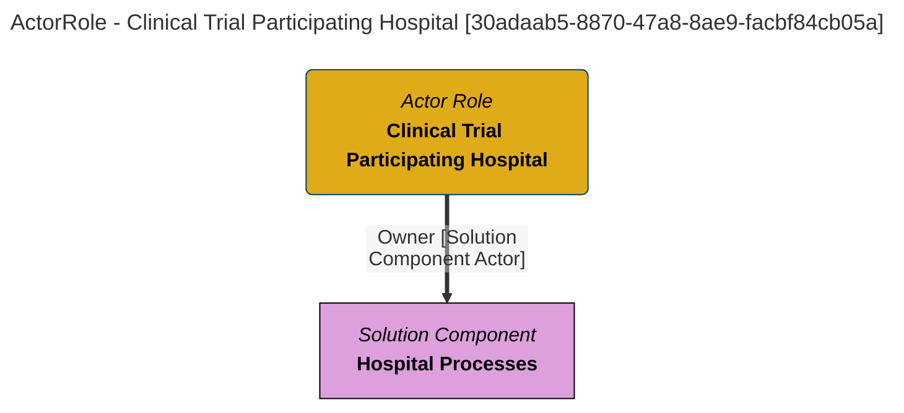

```mermaid
---
title: ActorRole - Clinical Trial Participating Hospital [30adaab5-8870-47a8-8ae9-facbf84cb05a]
---
flowchart TD
%%{init: {"flowchart": {"htmlLabels": false}} }%%

1@{ shape: rounded, label: "*Actor Role*
**Clinical Trial Participating Hospital**"}
2@{ shape: rect, label: "*Solution Component*
**Hospital Processes**"}
1==>|"Owner [Solution Component Actor]"|2
style 1 color:#000000, fill:#e0ab18, stroke:#004563
style 2 color:#000000, fill:#DDA0DD, stroke:#000000
```
