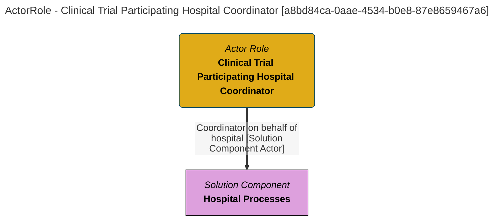

```mermaid
---
title: ActorRole - Clinical Trial Participating Hospital Coordinator [a8bd84ca-0aae-4534-b0e8-87e8659467a6]
---
flowchart TD
%%{init: {"flowchart": {"htmlLabels": false}} }%%

1@{ shape: rounded, label: "*Actor Role*
**Clinical Trial Participating Hospital Coordinator**"}
2@{ shape: rect, label: "*Solution Component*
**Hospital Processes**"}
1==>|"Coordinator on behalf of hospital [Solution Component Actor]"|2
style 1 color:#000000, fill:#e0ab18, stroke:#004563
style 2 color:#000000, fill:#DDA0DD, stroke:#000000
```
