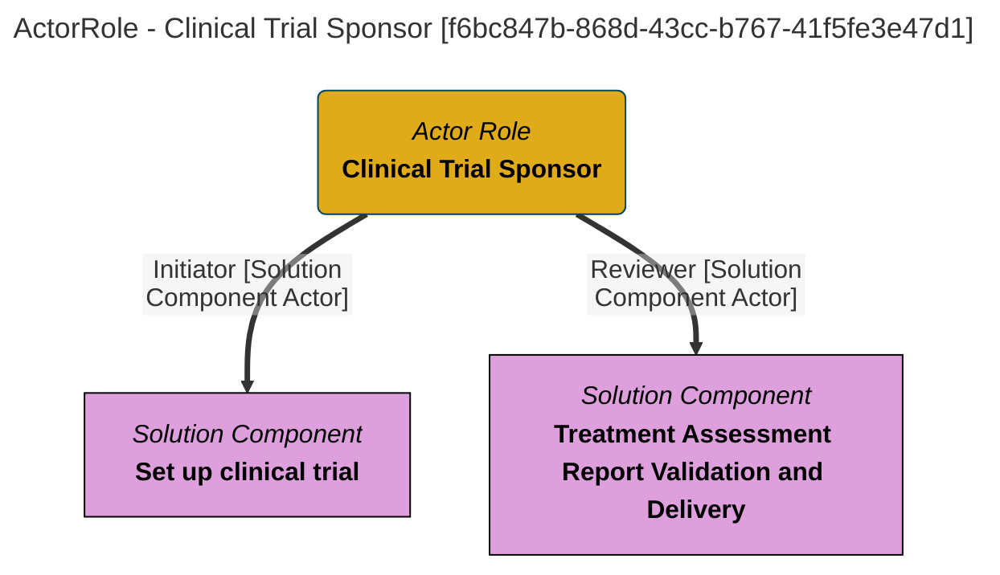

```mermaid
---
title: ActorRole - Clinical Trial Sponsor [f6bc847b-868d-43cc-b767-41f5fe3e47d1]
---
flowchart TD
%%{init: {"flowchart": {"htmlLabels": false}} }%%

1@{ shape: rounded, label: "*Actor Role*
**Clinical Trial Sponsor**"}
2@{ shape: rect, label: "*Solution Component*
**Set up clinical trial**"}
1==>|"Initiator [Solution Component Actor]"|2
3@{ shape: rect, label: "*Solution Component*
**Treatment Assessment Report Validation and Delivery**"}
1==>|"Reviewer [Solution Component Actor]"|3
style 1 color:#000000, fill:#e0ab18, stroke:#004563
style 2 color:#000000, fill:#DDA0DD, stroke:#000000
style 3 color:#000000, fill:#DDA0DD, stroke:#000000
```
