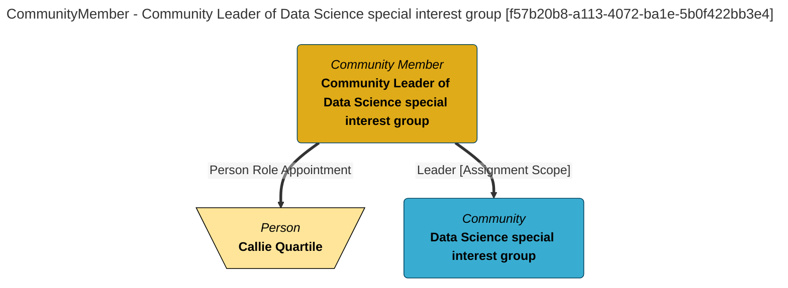

```mermaid
---
title: CommunityMember - Community Leader of Data Science special interest group [f57b20b8-a113-4072-ba1e-5b0f422bb3e4]
---
flowchart TD
%%{init: {"flowchart": {"htmlLabels": false}} }%%

1@{ shape: rounded, label: "*Community Member*
**Community Leader of Data Science special interest group**"}
2@{ shape: trap-t, label: "*Person*
**Callie Quartile**"}
1==>|"Person Role Appointment"|2
3@{ shape: rounded, label: "*Community*
**Data Science special interest group**"}
1==>|"Leader [Assignment Scope]"|3
style 1 color:#000000, fill:#e0ab18, stroke:#004563
style 2 color:#000000, fill:#FFE599, stroke:#000000
style 3 color:#000000, fill:#39add1, stroke:#004563
```
