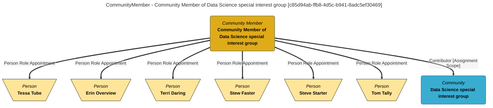

```mermaid
---
title: CommunityMember - Community Member of Data Science special interest group [c85d94ab-ffb8-4d5c-b941-8adc5ef30469]
---
flowchart TD
%%{init: {"flowchart": {"htmlLabels": false}} }%%

1@{ shape: rounded, label: "*Community Member*
**Community Member of Data Science special interest group**"}
2@{ shape: trap-t, label: "*Person*
**Tessa Tube**"}
1==>|"Person Role Appointment"|2
3@{ shape: trap-t, label: "*Person*
**Erin Overview**"}
1==>|"Person Role Appointment"|3
4@{ shape: trap-t, label: "*Person*
**Terri Daring**"}
1==>|"Person Role Appointment"|4
5@{ shape: trap-t, label: "*Person*
**Stew Faster**"}
1==>|"Person Role Appointment"|5
6@{ shape: trap-t, label: "*Person*
**Steve Starter**"}
1==>|"Person Role Appointment"|6
7@{ shape: trap-t, label: "*Person*
**Tom Tally**"}
1==>|"Person Role Appointment"|7
8@{ shape: rounded, label: "*Community*
**Data Science special interest group**"}
1==>|"Contributor [Assignment Scope]"|8
style 1 color:#000000, fill:#e0ab18, stroke:#004563
style 2 color:#000000, fill:#FFE599, stroke:#000000
style 3 color:#000000, fill:#FFE599, stroke:#000000
style 4 color:#000000, fill:#FFE599, stroke:#000000
style 5 color:#000000, fill:#FFE599, stroke:#000000
style 6 color:#000000, fill:#FFE599, stroke:#000000
style 7 color:#000000, fill:#FFE599, stroke:#000000
style 8 color:#000000, fill:#39add1, stroke:#004563
```
