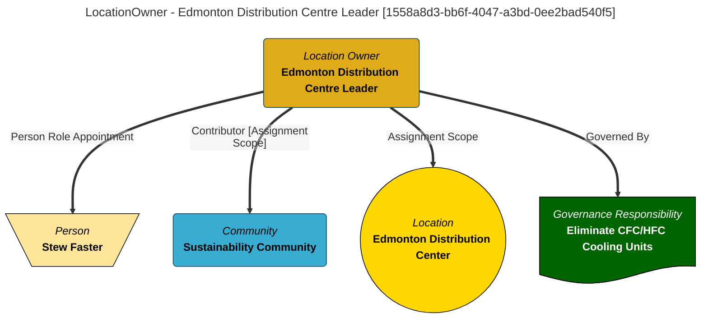

```mermaid
---
title: LocationOwner - Edmonton Distribution Centre Leader [1558a8d3-bb6f-4047-a3bd-0ee2bad540f5]
---
flowchart TD
%%{init: {"flowchart": {"htmlLabels": false}} }%%

1@{ shape: rounded, label: "*Location Owner*
**Edmonton Distribution Centre Leader**"}
2@{ shape: trap-t, label: "*Person*
**Stew Faster**"}
1==>|"Person Role Appointment"|2
3@{ shape: rounded, label: "*Community*
**Sustainability Community**"}
1==>|"Contributor [Assignment Scope]"|3
4@{ shape: circle, label: "*Location*
**Edmonton Distribution Center**"}
1==>|"Assignment Scope"|4
5@{ shape: doc, label: "*Governance Responsibility*
**Eliminate CFC/HFC Cooling Units**"}
1==>|"Governed By"|5
style 1 color:#000000, fill:#e0ab18, stroke:#004563
style 2 color:#000000, fill:#FFE599, stroke:#000000
style 3 color:#000000, fill:#39add1, stroke:#004563
style 4 color:#000000, fill:#FFD700, stroke:#000000
style 5 color:#FFFFFF, fill:#006400, stroke:#000000
```
