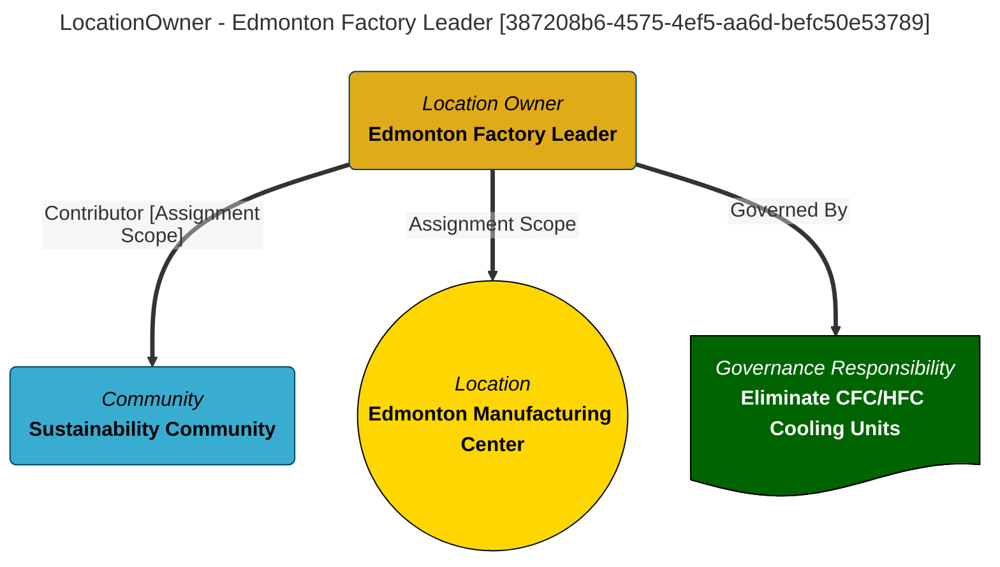

```mermaid
---
title: LocationOwner - Edmonton Factory Leader [387208b6-4575-4ef5-aa6d-befc50e53789]
---
flowchart TD
%%{init: {"flowchart": {"htmlLabels": false}} }%%

1@{ shape: rounded, label: "*Location Owner*
**Edmonton Factory Leader**"}
2@{ shape: rounded, label: "*Community*
**Sustainability Community**"}
1==>|"Contributor [Assignment Scope]"|2
3@{ shape: circle, label: "*Location*
**Edmonton Manufacturing Center**"}
1==>|"Assignment Scope"|3
4@{ shape: doc, label: "*Governance Responsibility*
**Eliminate CFC/HFC Cooling Units**"}
1==>|"Governed By"|4
style 1 color:#000000, fill:#e0ab18, stroke:#004563
style 2 color:#000000, fill:#39add1, stroke:#004563
style 3 color:#000000, fill:#FFD700, stroke:#000000
style 4 color:#FFFFFF, fill:#006400, stroke:#000000
```
