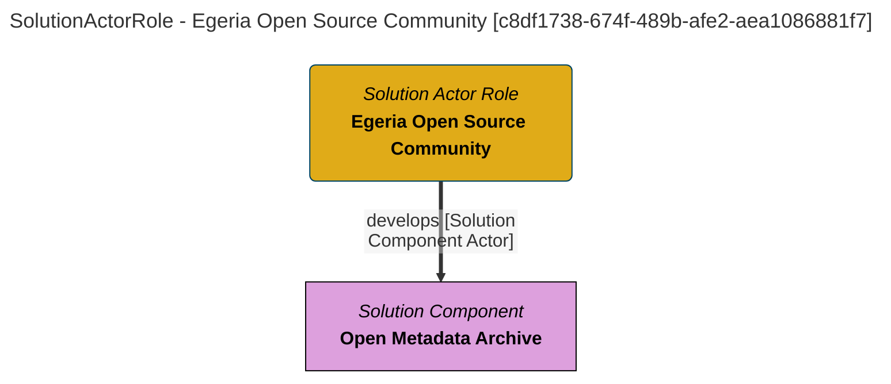

```mermaid
---
title: SolutionActorRole - Egeria Open Source Community [c8df1738-674f-489b-afe2-aea1086881f7]
---
flowchart TD
%%{init: {"flowchart": {"htmlLabels": false}} }%%

1@{ shape: rounded, label: "*Solution Actor Role*
**Egeria Open Source Community**"}
2@{ shape: rect, label: "*Solution Component*
**Open Metadata Archive**"}
1==>|"develops [Solution Component Actor]"|2
style 1 color:#000000, fill:#e0ab18, stroke:#004563
style 2 color:#000000, fill:#DDA0DD, stroke:#000000
click 2 "https://egeria-project.org/concepts/open-metadata-archive/" "Click for more documentation" _blank
```
