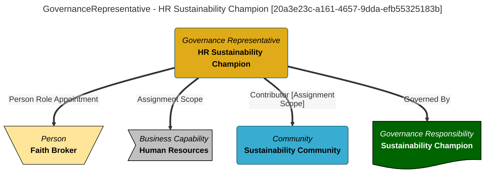

```mermaid
---
title: GovernanceRepresentative - HR Sustainability Champion [20a3e23c-a161-4657-9dda-efb55325183b]
---
flowchart TD
%%{init: {"flowchart": {"htmlLabels": false}} }%%

1@{ shape: rounded, label: "*Governance Representative*
**HR Sustainability Champion**"}
2@{ shape: trap-t, label: "*Person*
**Faith Broker**"}
1==>|"Person Role Appointment"|2
3@{ shape: odd, label: "*Business Capability*
**Human Resources**"}
1==>|"Assignment Scope"|3
4@{ shape: rounded, label: "*Community*
**Sustainability Community**"}
1==>|"Contributor [Assignment Scope]"|4
5@{ shape: doc, label: "*Governance Responsibility*
**Sustainability Champion**"}
1==>|"Governed By"|5
style 1 color:#000000, fill:#e0ab18, stroke:#004563
style 2 color:#000000, fill:#FFE599, stroke:#000000
style 3 color:#000000, fill:#C0C0C0, stroke:#000000
style 4 color:#000000, fill:#39add1, stroke:#004563
style 5 color:#FFFFFF, fill:#006400, stroke:#000000
```
