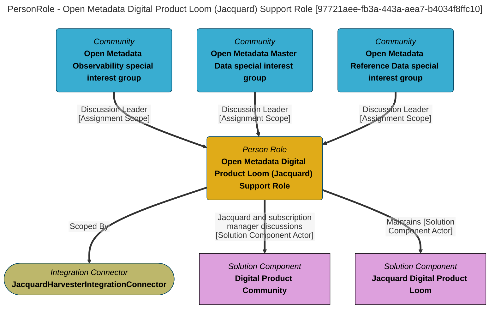

```mermaid
---
title: PersonRole - Open Metadata Digital Product Loom (Jacquard) Support Role [97721aee-fb3a-443a-aea7-b4034f8ffc10]
---
flowchart TD
%%{init: {"flowchart": {"htmlLabels": false}} }%%

1@{ shape: rounded, label: "*Person Role*
**Open Metadata Digital Product Loom (Jacquard) Support Role**"}
2@{ shape: stadium, label: "*Integration Connector*
**JacquardHarvesterIntegrationConnector**"}
1==>|"Scoped By"|2
3@{ shape: rounded, label: "*Community*
**Open Metadata Observability special interest group**"}
3==>|"Discussion Leader [Assignment Scope]"|1
4@{ shape: rounded, label: "*Community*
**Open Metadata Master Data special interest group**"}
4==>|"Discussion Leader [Assignment Scope]"|1
5@{ shape: rounded, label: "*Community*
**Open Metadata Reference Data special interest group**"}
5==>|"Discussion Leader [Assignment Scope]"|1
6@{ shape: rect, label: "*Solution Component*
**Digital Product Community**"}
1==>|"Jacquard and subscription manager discussions [Solution Component Actor]"|6
7@{ shape: rect, label: "*Solution Component*
**Jacquard Digital Product Loom**"}
1==>|"Maintains [Solution Component Actor]"|7
style 1 color:#000000, fill:#e0ab18, stroke:#004563
style 2 color:#000000, fill:#BDB76B, stroke:#004563
style 3 color:#000000, fill:#39add1, stroke:#004563
style 4 color:#000000, fill:#39add1, stroke:#004563
style 5 color:#000000, fill:#39add1, stroke:#004563
style 6 color:#000000, fill:#DDA0DD, stroke:#000000
style 7 color:#000000, fill:#DDA0DD, stroke:#000000
```
