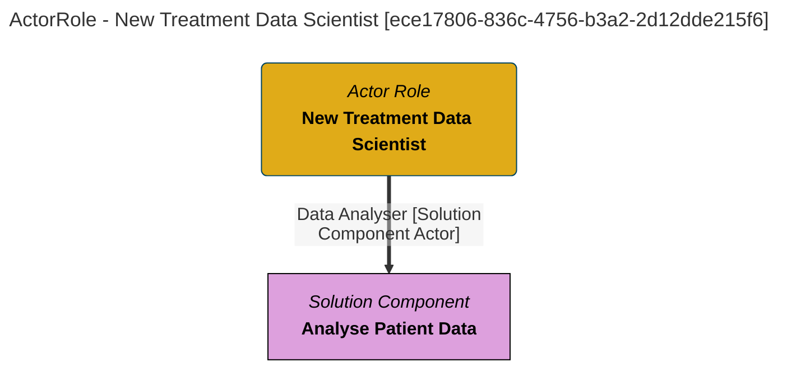

```mermaid
---
title: ActorRole - New Treatment Data Scientist [ece17806-836c-4756-b3a2-2d12dde215f6]
---
flowchart TD
%%{init: {"flowchart": {"htmlLabels": false}} }%%

1@{ shape: rounded, label: "*Actor Role*
**New Treatment Data Scientist**"}
2@{ shape: rect, label: "*Solution Component*
**Analyse Patient Data**"}
1==>|"Data Analyser [Solution Component Actor]"|2
style 1 color:#000000, fill:#e0ab18, stroke:#004563
style 2 color:#000000, fill:#DDA0DD, stroke:#000000
```
