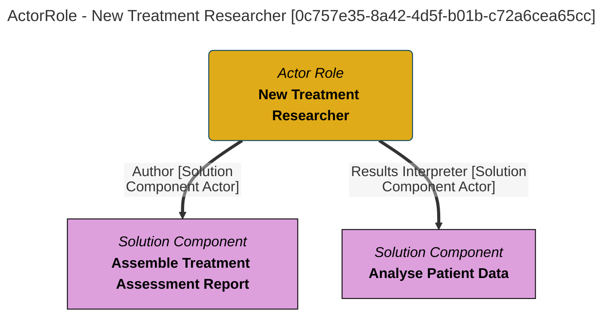

```mermaid
---
title: ActorRole - New Treatment Researcher [0c757e35-8a42-4d5f-b01b-c72a6cea65cc]
---
flowchart TD
%%{init: {"flowchart": {"htmlLabels": false}} }%%

1@{ shape: rounded, label: "*Actor Role*
**New Treatment Researcher**"}
2@{ shape: rect, label: "*Solution Component*
**Assemble Treatment Assessment Report**"}
1==>|"Author [Solution Component Actor]"|2
3@{ shape: rect, label: "*Solution Component*
**Analyse Patient Data**"}
1==>|"Results Interpreter [Solution Component Actor]"|3
style 1 color:#000000, fill:#e0ab18, stroke:#004563
style 2 color:#000000, fill:#DDA0DD, stroke:#000000
style 3 color:#000000, fill:#DDA0DD, stroke:#000000
```
