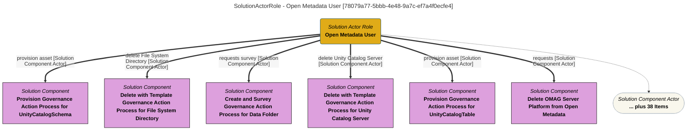

```mermaid
---
title: SolutionActorRole - Open Metadata User [78079a77-5bbb-4e48-9a7c-ef7a4f0ecfe4]
---
flowchart TD
%%{init: {"flowchart": {"htmlLabels": false}} }%%

1@{ shape: rounded, label: "*Solution Actor Role*
**Open Metadata User**"}
2@{ shape: rect, label: "*Solution Component*
**Provision Governance Action Process for UnityCatalogSchema**"}
1==>|"provision asset [Solution Component Actor]"|2
3@{ shape: rect, label: "*Solution Component*
**Delete with Template Governance Action Process for File System Directory**"}
1==>|"delete File System Directory [Solution Component Actor]"|3
4@{ shape: rect, label: "*Solution Component*
**Create and Survey Governance Action Process for Data Folder**"}
1==>|"requests survey [Solution Component Actor]"|4
5@{ shape: rect, label: "*Solution Component*
**Delete with Template Governance Action Process for Unity Catalog Server**"}
1==>|"delete Unity Catalog Server [Solution Component Actor]"|5
6@{ shape: rect, label: "*Solution Component*
**Provision Governance Action Process for UnityCatalogTable**"}
1==>|"provision asset [Solution Component Actor]"|6
7@{ shape: rect, label: "*Solution Component*
**Delete OMAG Server Platform from Open Metadata**"}
1==>|"requests [Solution Component Actor]"|7
8@{ shape: stadium, label: "*Solution Component Actor*
**... plus 38 Items**"}
1-.->8
style 1 color:#000000, fill:#e0ab18, stroke:#004563
style 2 color:#000000, fill:#DDA0DD, stroke:#000000
style 3 color:#000000, fill:#DDA0DD, stroke:#000000
style 4 color:#000000, fill:#DDA0DD, stroke:#000000
style 5 color:#000000, fill:#DDA0DD, stroke:#000000
style 6 color:#000000, fill:#DDA0DD, stroke:#000000
style 7 color:#000000, fill:#DDA0DD, stroke:#000000
style 8 color:#000000, fill:#F9F7ED, stroke:#b7c0c7
click 2 "https://egeria-project.org/egeria-solutions/leveraging-unity-catalog/overview/" "Click for more documentation" _blank
click 3 "https://egeria-project.org/egeria-solutions/leveraging-files/overview/" "Click for more documentation" _blank
click 4 "https://egeria-project.org/egeria-solutions/leveraging-files/overview/" "Click for more documentation" _blank
click 5 "https://egeria-project.org/egeria-solutions/leveraging-unity-catalog/overview/" "Click for more documentation" _blank
click 6 "https://egeria-project.org/egeria-solutions/leveraging-unity-catalog/overview/" "Click for more documentation" _blank
click 7 "https://egeria-project.org/concepts/governance-action-type/" "Click for more documentation" _blank
```
