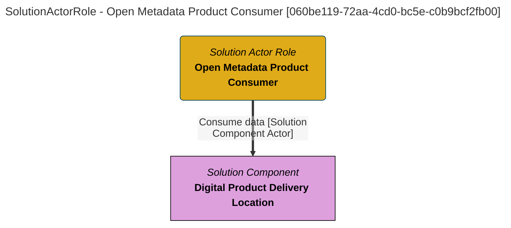

```mermaid
---
title: SolutionActorRole - Open Metadata Product Consumer [060be119-72aa-4cd0-bc5e-c0b9bcf2fb00]
---
flowchart TD
%%{init: {"flowchart": {"htmlLabels": false}} }%%

1@{ shape: rounded, label: "*Solution Actor Role*
**Open Metadata Product Consumer**"}
2@{ shape: rect, label: "*Solution Component*
**Digital Product Delivery Location**"}
1==>|"Consume data [Solution Component Actor]"|2
style 1 color:#000000, fill:#e0ab18, stroke:#004563
style 2 color:#000000, fill:#DDA0DD, stroke:#000000
```
