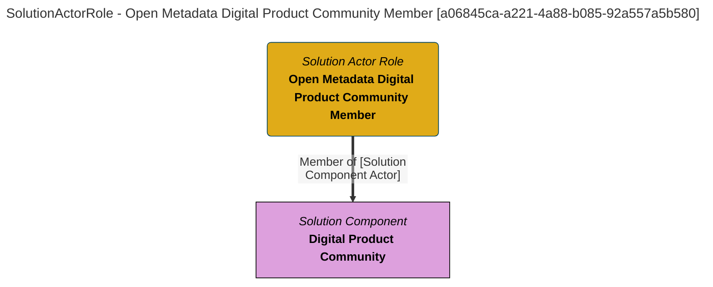

```mermaid
---
title: SolutionActorRole - Open Metadata Digital Product Community Member [a06845ca-a221-4a88-b085-92a557a5b580]
---
flowchart TD
%%{init: {"flowchart": {"htmlLabels": false}} }%%

1@{ shape: rounded, label: "*Solution Actor Role*
**Open Metadata Digital Product Community Member**"}
2@{ shape: rect, label: "*Solution Component*
**Digital Product Community**"}
1==>|"Member of [Solution Component Actor]"|2
style 1 color:#000000, fill:#e0ab18, stroke:#004563
style 2 color:#000000, fill:#DDA0DD, stroke:#000000
```
