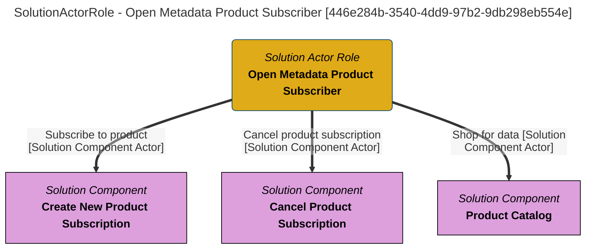

```mermaid
---
title: SolutionActorRole - Open Metadata Product Subscriber [446e284b-3540-4dd9-97b2-9db298eb554e]
---
flowchart TD
%%{init: {"flowchart": {"htmlLabels": false}} }%%

1@{ shape: rounded, label: "*Solution Actor Role*
**Open Metadata Product Subscriber**"}
2@{ shape: rect, label: "*Solution Component*
**Create New Product Subscription**"}
1==>|"Subscribe to product [Solution Component Actor]"|2
3@{ shape: rect, label: "*Solution Component*
**Cancel Product Subscription**"}
1==>|"Cancel product subscription [Solution Component Actor]"|3
4@{ shape: rect, label: "*Solution Component*
**Product Catalog**"}
1==>|"Shop for data [Solution Component Actor]"|4
style 1 color:#000000, fill:#e0ab18, stroke:#004563
style 2 color:#000000, fill:#DDA0DD, stroke:#000000
style 3 color:#000000, fill:#DDA0DD, stroke:#000000
style 4 color:#000000, fill:#DDA0DD, stroke:#000000
```
