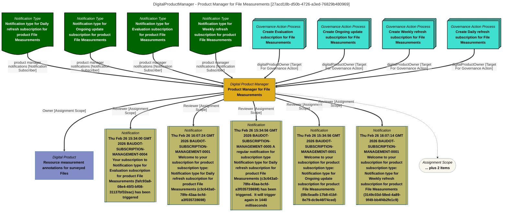

```mermaid
---
title: DigitalProductManager - Product Manager for File Measurements [27acd18b-d50b-4726-a3ed-76829b480969]
---
flowchart TD
%%{init: {"flowchart": {"htmlLabels": false}} }%%

1@{ shape: rounded, label: "*Digital Product Manager*
**Product Manager for File Measurements**"}
2@{ shape: rect, label: "*Digital Product*
**Resource measurement annotations for surveyed Files**"}
1==>|"Owner [Assignment Scope]"|2
3@{ shape: subproc, label: "*Notification*
**Thu Feb 26 15:34:00 GMT 2026 BAUDOT-SUBSCRIPTION-MANAGEMENT-0004 Your subscription to Notification type for Evaluation subscription for product File Measurements (fafc93a8-08e4-45f3-bf08-31137bf32eac) has been triggered**"}
1==>|"Reviewer [Assignment Scope]"|3
4@{ shape: subproc, label: "*Notification*
**Thu Feb 26 16:07:24 GMT 2026 BAUDOT-SUBSCRIPTION-MANAGEMENT-0001 Welcome to your subscription for product subscription type: Notification type for Daily refresh subscription for product File Measurements (c3c643a0-78fe-43aa-bcfd-a3f035728698)**"}
1==>|"Reviewer [Assignment Scope]"|4
5@{ shape: subproc, label: "*Notification*
**Thu Feb 26 15:34:56 GMT 2026 BAUDOT-SUBSCRIPTION-MANAGEMENT-0005 A regular notification for subscription type Notification type for Daily refresh subscription for product File Measurements (c3c643a0-78fe-43aa-bcfd-a3f035728698) has been triggered.  It will trigger again in 1440 milliseconds**"}
1==>|"Reviewer [Assignment Scope]"|5
6@{ shape: subproc, label: "*Notification*
**Thu Feb 26 15:34:56 GMT 2026 BAUDOT-SUBSCRIPTION-MANAGEMENT-0001 Welcome to your subscription for product subscription type: Notification type for Ongoing update subscription for product File Measurements (08c5eadb-17b8-41bf-8e79-dc9e46f74ced)**"}
1==>|"Reviewer [Assignment Scope]"|6
7@{ shape: subproc, label: "*Notification*
**Thu Feb 26 16:07:14 GMT 2026 BAUDOT-SUBSCRIPTION-MANAGEMENT-0001 Welcome to your subscription for product subscription type: Notification type for Weekly refresh subscription for product File Measurements (3149c03d-58ed-4a89-9f49-bb4f4b2fe1c9)**"}
1==>|"Reviewer [Assignment Scope]"|7
8@{ shape: stadium, label: "*Assignment Scope*
**... plus 2 Items**"}
1-.->8
9@{ shape: doc, label: "*Notification Type*
**Notification type for Daily refresh subscription for product File Measurements**"}
9==>|"product manager notifications [Notification Subscriber]"|1
10@{ shape: doc, label: "*Notification Type*
**Notification type for Ongoing update subscription for product File Measurements**"}
10==>|"product manager notifications [Notification Subscriber]"|1
11@{ shape: doc, label: "*Notification Type*
**Notification type for Evaluation subscription for product File Measurements**"}
11==>|"product manager notifications [Notification Subscriber]"|1
12@{ shape: doc, label: "*Notification Type*
**Notification type for Weekly refresh subscription for product File Measurements**"}
12==>|"product manager notifications [Notification Subscriber]"|1
13@{ shape: processes, label: "*Governance Action Process*
**Create Evaluation subscription for File Measurements**"}
13==>|"digitalProductOwner [Target For Governance Action]"|1
14@{ shape: processes, label: "*Governance Action Process*
**Create Ongoing update subscription for File Measurements**"}
14==>|"digitalProductOwner [Target For Governance Action]"|1
15@{ shape: processes, label: "*Governance Action Process*
**Create Weekly refresh subscription for File Measurements**"}
15==>|"digitalProductOwner [Target For Governance Action]"|1
16@{ shape: processes, label: "*Governance Action Process*
**Create Daily refresh subscription for File Measurements**"}
16==>|"digitalProductOwner [Target For Governance Action]"|1
style 11 color:#FFFFFF, fill:#006400, stroke:#000000
style 12 color:#FFFFFF, fill:#006400, stroke:#000000
style 13 color:#000000, fill:#40E0D0, stroke:#000000
style 14 color:#000000, fill:#40E0D0, stroke:#000000
style 15 color:#000000, fill:#40E0D0, stroke:#000000
style 16 color:#000000, fill:#40E0D0, stroke:#000000
style 1 color:#000000, fill:#e0ab18, stroke:#004563
style 2 color:#000000, fill:#838cc7, stroke:#3079ab
style 3 color:#000000, fill:#BDB76B, stroke:#004563
style 4 color:#000000, fill:#BDB76B, stroke:#004563
style 5 color:#000000, fill:#BDB76B, stroke:#004563
style 6 color:#000000, fill:#BDB76B, stroke:#004563
style 7 color:#000000, fill:#BDB76B, stroke:#004563
style 8 color:#000000, fill:#F9F7ED, stroke:#b7c0c7
style 9 color:#FFFFFF, fill:#006400, stroke:#000000
style 10 color:#FFFFFF, fill:#006400, stroke:#000000
```
