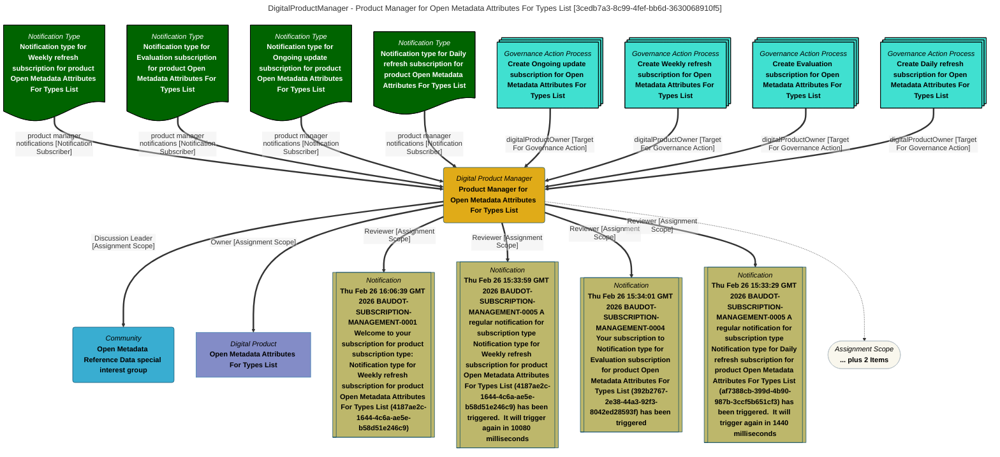

```mermaid
---
title: DigitalProductManager - Product Manager for Open Metadata Attributes For Types List [3cedb7a3-8c99-4fef-bb6d-3630068910f5]
---
flowchart TD
%%{init: {"flowchart": {"htmlLabels": false}} }%%

1@{ shape: rounded, label: "*Digital Product Manager*
**Product Manager for Open Metadata Attributes For Types List**"}
2@{ shape: rounded, label: "*Community*
**Open Metadata Reference Data special interest group**"}
1==>|"Discussion Leader [Assignment Scope]"|2
3@{ shape: rect, label: "*Digital Product*
**Open Metadata Attributes For Types List**"}
1==>|"Owner [Assignment Scope]"|3
4@{ shape: subproc, label: "*Notification*
**Thu Feb 26 16:06:39 GMT 2026 BAUDOT-SUBSCRIPTION-MANAGEMENT-0001 Welcome to your subscription for product subscription type: Notification type for Weekly refresh subscription for product Open Metadata Attributes For Types List (4187ae2c-1644-4c6a-ae5e-b58d51e246c9)**"}
1==>|"Reviewer [Assignment Scope]"|4
5@{ shape: subproc, label: "*Notification*
**Thu Feb 26 15:33:59 GMT 2026 BAUDOT-SUBSCRIPTION-MANAGEMENT-0005 A regular notification for subscription type Notification type for Weekly refresh subscription for product Open Metadata Attributes For Types List (4187ae2c-1644-4c6a-ae5e-b58d51e246c9) has been triggered.  It will trigger again in 10080 milliseconds**"}
1==>|"Reviewer [Assignment Scope]"|5
6@{ shape: subproc, label: "*Notification*
**Thu Feb 26 15:34:01 GMT 2026 BAUDOT-SUBSCRIPTION-MANAGEMENT-0004 Your subscription to Notification type for Evaluation subscription for product Open Metadata Attributes For Types List (392b2767-2e38-44a3-92f3-8042ed28593f) has been triggered**"}
1==>|"Reviewer [Assignment Scope]"|6
7@{ shape: subproc, label: "*Notification*
**Thu Feb 26 15:33:29 GMT 2026 BAUDOT-SUBSCRIPTION-MANAGEMENT-0005 A regular notification for subscription type Notification type for Daily refresh subscription for product Open Metadata Attributes For Types List (af7388cb-399d-4b90-987b-3ccf5b651cf3) has been triggered.  It will trigger again in 1440 milliseconds**"}
1==>|"Reviewer [Assignment Scope]"|7
8@{ shape: stadium, label: "*Assignment Scope*
**... plus 2 Items**"}
1-.->8
9@{ shape: doc, label: "*Notification Type*
**Notification type for Weekly refresh subscription for product Open Metadata Attributes For Types List**"}
9==>|"product manager notifications [Notification Subscriber]"|1
10@{ shape: doc, label: "*Notification Type*
**Notification type for Evaluation subscription for product Open Metadata Attributes For Types List**"}
10==>|"product manager notifications [Notification Subscriber]"|1
11@{ shape: doc, label: "*Notification Type*
**Notification type for Ongoing update subscription for product Open Metadata Attributes For Types List**"}
11==>|"product manager notifications [Notification Subscriber]"|1
12@{ shape: doc, label: "*Notification Type*
**Notification type for Daily refresh subscription for product Open Metadata Attributes For Types List**"}
12==>|"product manager notifications [Notification Subscriber]"|1
13@{ shape: processes, label: "*Governance Action Process*
**Create Ongoing update subscription for Open Metadata Attributes For Types List**"}
13==>|"digitalProductOwner [Target For Governance Action]"|1
14@{ shape: processes, label: "*Governance Action Process*
**Create Weekly refresh subscription for Open Metadata Attributes For Types List**"}
14==>|"digitalProductOwner [Target For Governance Action]"|1
15@{ shape: processes, label: "*Governance Action Process*
**Create Evaluation subscription for Open Metadata Attributes For Types List**"}
15==>|"digitalProductOwner [Target For Governance Action]"|1
16@{ shape: processes, label: "*Governance Action Process*
**Create Daily refresh subscription for Open Metadata Attributes For Types List**"}
16==>|"digitalProductOwner [Target For Governance Action]"|1
style 11 color:#FFFFFF, fill:#006400, stroke:#000000
style 12 color:#FFFFFF, fill:#006400, stroke:#000000
style 13 color:#000000, fill:#40E0D0, stroke:#000000
style 14 color:#000000, fill:#40E0D0, stroke:#000000
style 15 color:#000000, fill:#40E0D0, stroke:#000000
style 16 color:#000000, fill:#40E0D0, stroke:#000000
style 1 color:#000000, fill:#e0ab18, stroke:#004563
style 2 color:#000000, fill:#39add1, stroke:#004563
style 3 color:#000000, fill:#838cc7, stroke:#3079ab
style 4 color:#000000, fill:#BDB76B, stroke:#004563
style 5 color:#000000, fill:#BDB76B, stroke:#004563
style 6 color:#000000, fill:#BDB76B, stroke:#004563
style 7 color:#000000, fill:#BDB76B, stroke:#004563
style 8 color:#000000, fill:#F9F7ED, stroke:#b7c0c7
style 9 color:#FFFFFF, fill:#006400, stroke:#000000
style 10 color:#FFFFFF, fill:#006400, stroke:#000000
```
