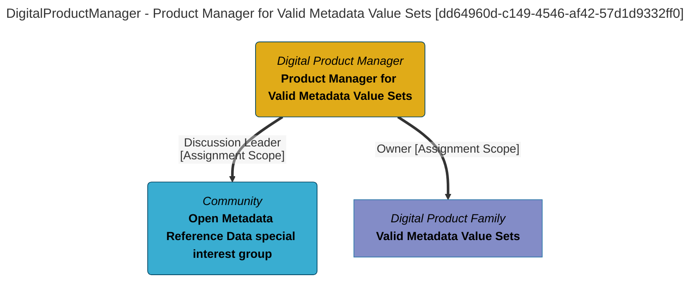

```mermaid
---
title: DigitalProductManager - Product Manager for Valid Metadata Value Sets [dd64960d-c149-4546-af42-57d1d9332ff0]
---
flowchart TD
%%{init: {"flowchart": {"htmlLabels": false}} }%%

1@{ shape: rounded, label: "*Digital Product Manager*
**Product Manager for Valid Metadata Value Sets**"}
2@{ shape: rounded, label: "*Community*
**Open Metadata Reference Data special interest group**"}
1==>|"Discussion Leader [Assignment Scope]"|2
3@{ shape: rect, label: "*Digital Product Family*
**Valid Metadata Value Sets**"}
1==>|"Owner [Assignment Scope]"|3
style 1 color:#000000, fill:#e0ab18, stroke:#004563
style 2 color:#000000, fill:#39add1, stroke:#004563
style 3 color:#000000, fill:#838cc7, stroke:#3079ab
```
