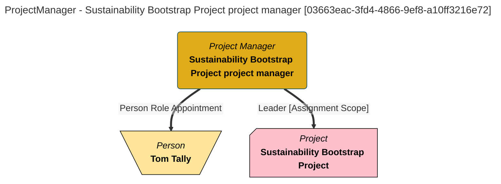

```mermaid
---
title: ProjectManager - Sustainability Bootstrap Project project manager [03663eac-3fd4-4866-9ef8-a10ff3216e72]
---
flowchart TD
%%{init: {"flowchart": {"htmlLabels": false}} }%%

1@{ shape: rounded, label: "*Project Manager*
**Sustainability Bootstrap Project project manager**"}
2@{ shape: trap-t, label: "*Person*
**Tom Tally**"}
1==>|"Person Role Appointment"|2
3@{ shape: notch-rect, label: "*Project*
**Sustainability Bootstrap Project**"}
1==>|"Leader [Assignment Scope]"|3
style 1 color:#000000, fill:#e0ab18, stroke:#004563
style 2 color:#000000, fill:#FFE599, stroke:#000000
style 3 color:#000000, fill:#FFC0CB, stroke:#000000
```
