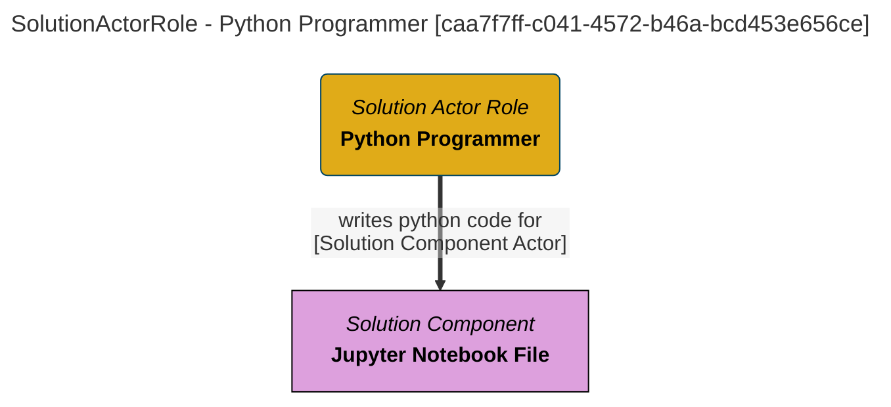

```mermaid
---
title: SolutionActorRole - Python Programmer [caa7f7ff-c041-4572-b46a-bcd453e656ce]
---
flowchart TD
%%{init: {"flowchart": {"htmlLabels": false}} }%%

1@{ shape: rounded, label: "*Solution Actor Role*
**Python Programmer**"}
2@{ shape: rect, label: "*Solution Component*
**Jupyter Notebook File**"}
1==>|"writes python code for [Solution Component Actor]"|2
style 1 color:#000000, fill:#e0ab18, stroke:#004563
style 2 color:#000000, fill:#DDA0DD, stroke:#000000
click 2 "https://jupyter.org/" "Click for more documentation" _blank
```
