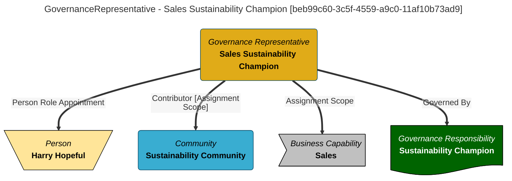

```mermaid
---
title: GovernanceRepresentative - Sales Sustainability Champion [beb99c60-3c5f-4559-a9c0-11af10b73ad9]
---
flowchart TD
%%{init: {"flowchart": {"htmlLabels": false}} }%%

1@{ shape: rounded, label: "*Governance Representative*
**Sales Sustainability Champion**"}
2@{ shape: trap-t, label: "*Person*
**Harry Hopeful**"}
1==>|"Person Role Appointment"|2
3@{ shape: rounded, label: "*Community*
**Sustainability Community**"}
1==>|"Contributor [Assignment Scope]"|3
4@{ shape: odd, label: "*Business Capability*
**Sales**"}
1==>|"Assignment Scope"|4
5@{ shape: doc, label: "*Governance Responsibility*
**Sustainability Champion**"}
1==>|"Governed By"|5
style 1 color:#000000, fill:#e0ab18, stroke:#004563
style 2 color:#000000, fill:#FFE599, stroke:#000000
style 3 color:#000000, fill:#39add1, stroke:#004563
style 4 color:#000000, fill:#C0C0C0, stroke:#000000
style 5 color:#FFFFFF, fill:#006400, stroke:#000000
```
