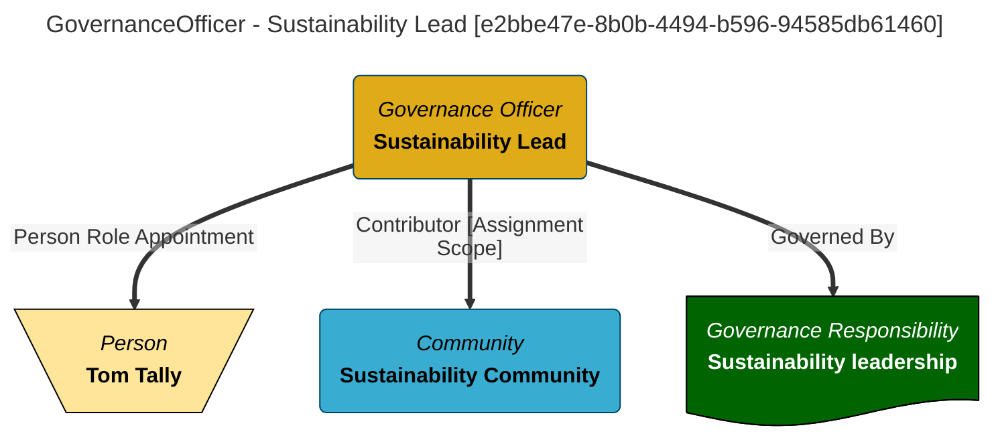

```mermaid
---
title: GovernanceOfficer - Sustainability Lead [e2bbe47e-8b0b-4494-b596-94585db61460]
---
flowchart TD
%%{init: {"flowchart": {"htmlLabels": false}} }%%

1@{ shape: rounded, label: "*Governance Officer*
**Sustainability Lead**"}
2@{ shape: trap-t, label: "*Person*
**Tom Tally**"}
1==>|"Person Role Appointment"|2
3@{ shape: rounded, label: "*Community*
**Sustainability Community**"}
1==>|"Contributor [Assignment Scope]"|3
4@{ shape: doc, label: "*Governance Responsibility*
**Sustainability leadership**"}
1==>|"Governed By"|4
style 1 color:#000000, fill:#e0ab18, stroke:#004563
style 2 color:#000000, fill:#FFE599, stroke:#000000
style 3 color:#000000, fill:#39add1, stroke:#004563
style 4 color:#FFFFFF, fill:#006400, stroke:#000000
```
