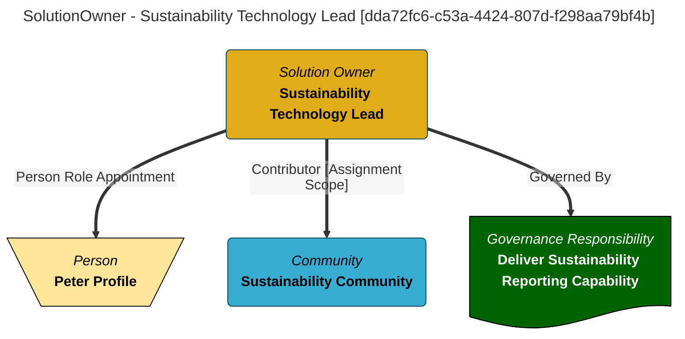

```mermaid
---
title: SolutionOwner - Sustainability Technology Lead [dda72fc6-c53a-4424-807d-f298aa79bf4b]
---
flowchart TD
%%{init: {"flowchart": {"htmlLabels": false}} }%%

1@{ shape: rounded, label: "*Solution Owner*
**Sustainability Technology Lead**"}
2@{ shape: trap-t, label: "*Person*
**Peter Profile**"}
1==>|"Person Role Appointment"|2
3@{ shape: rounded, label: "*Community*
**Sustainability Community**"}
1==>|"Contributor [Assignment Scope]"|3
4@{ shape: doc, label: "*Governance Responsibility*
**Deliver Sustainability Reporting Capability**"}
1==>|"Governed By"|4
style 1 color:#000000, fill:#e0ab18, stroke:#004563
style 2 color:#000000, fill:#FFE599, stroke:#000000
style 3 color:#000000, fill:#39add1, stroke:#004563
style 4 color:#FFFFFF, fill:#006400, stroke:#000000
```
