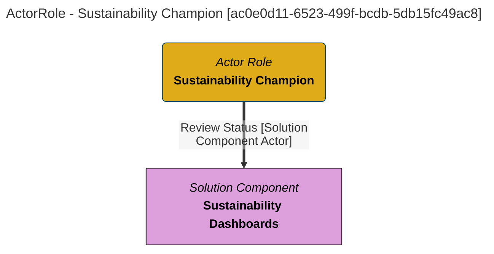

```mermaid
---
title: ActorRole - Sustainability Champion [ac0e0d11-6523-499f-bcdb-5db15fc49ac8]
---
flowchart TD
%%{init: {"flowchart": {"htmlLabels": false}} }%%

1@{ shape: rounded, label: "*Actor Role*
**Sustainability Champion**"}
2@{ shape: rect, label: "*Solution Component*
**Sustainability Dashboards**"}
1==>|"Review Status [Solution Component Actor]"|2
style 1 color:#000000, fill:#e0ab18, stroke:#004563
style 2 color:#000000, fill:#DDA0DD, stroke:#000000
```
