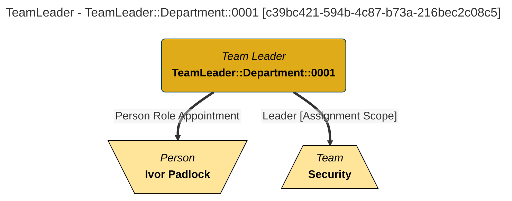

```mermaid
---
title: TeamLeader - TeamLeader::Department::0001 [c39bc421-594b-4c87-b73a-216bec2c08c5]
---
flowchart TD
%%{init: {"flowchart": {"htmlLabels": false}} }%%

1@{ shape: rounded, label: "*Team Leader*
**TeamLeader::Department::0001**"}
2@{ shape: trap-t, label: "*Person*
**Ivor Padlock**"}
1==>|"Person Role Appointment"|2
3@{ shape: trap-b, label: "*Team*
**Security**"}
1==>|"Leader [Assignment Scope]"|3
style 1 color:#000000, fill:#e0ab18, stroke:#004563
style 2 color:#000000, fill:#FFE599, stroke:#000000
style 3 color:#000000, fill:#FFE599, stroke:#000000
```
