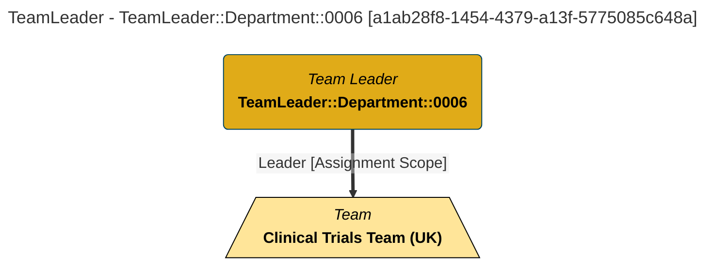

```mermaid
---
title: TeamLeader - TeamLeader::Department::0006 [a1ab28f8-1454-4379-a13f-5775085c648a]
---
flowchart TD
%%{init: {"flowchart": {"htmlLabels": false}} }%%

1@{ shape: rounded, label: "*Team Leader*
**TeamLeader::Department::0006**"}
2@{ shape: trap-b, label: "*Team*
**Clinical Trials Team (UK)**"}
1==>|"Leader [Assignment Scope]"|2
style 1 color:#000000, fill:#e0ab18, stroke:#004563
style 2 color:#000000, fill:#FFE599, stroke:#000000
```
