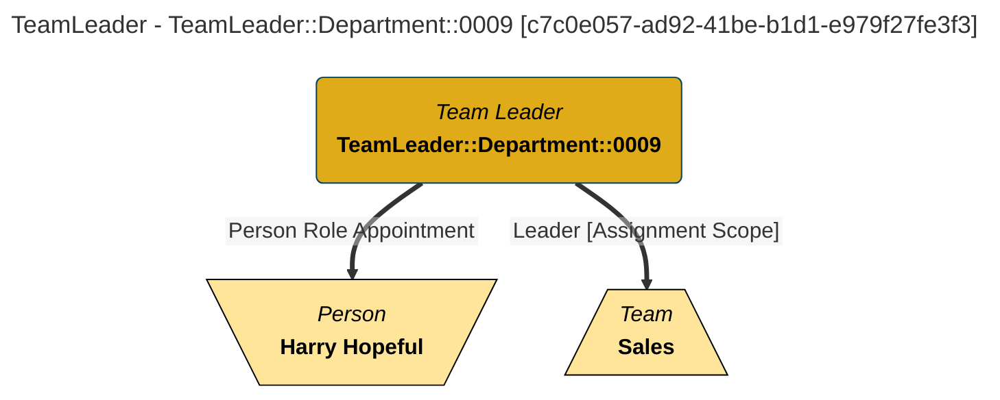

```mermaid
---
title: TeamLeader - TeamLeader::Department::0009 [c7c0e057-ad92-41be-b1d1-e979f27fe3f3]
---
flowchart TD
%%{init: {"flowchart": {"htmlLabels": false}} }%%

1@{ shape: rounded, label: "*Team Leader*
**TeamLeader::Department::0009**"}
2@{ shape: trap-t, label: "*Person*
**Harry Hopeful**"}
1==>|"Person Role Appointment"|2
3@{ shape: trap-b, label: "*Team*
**Sales**"}
1==>|"Leader [Assignment Scope]"|3
style 1 color:#000000, fill:#e0ab18, stroke:#004563
style 2 color:#000000, fill:#FFE599, stroke:#000000
style 3 color:#000000, fill:#FFE599, stroke:#000000
```
