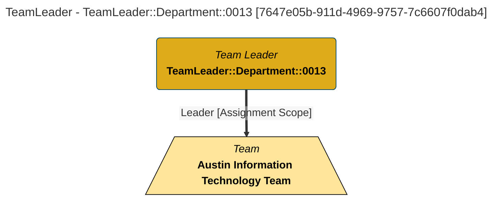

```mermaid
---
title: TeamLeader - TeamLeader::Department::0013 [7647e05b-911d-4969-9757-7c6607f0dab4]
---
flowchart TD
%%{init: {"flowchart": {"htmlLabels": false}} }%%

1@{ shape: rounded, label: "*Team Leader*
**TeamLeader::Department::0013**"}
2@{ shape: trap-b, label: "*Team*
**Austin Information Technology Team**"}
1==>|"Leader [Assignment Scope]"|2
style 1 color:#000000, fill:#e0ab18, stroke:#004563
style 2 color:#000000, fill:#FFE599, stroke:#000000
```
