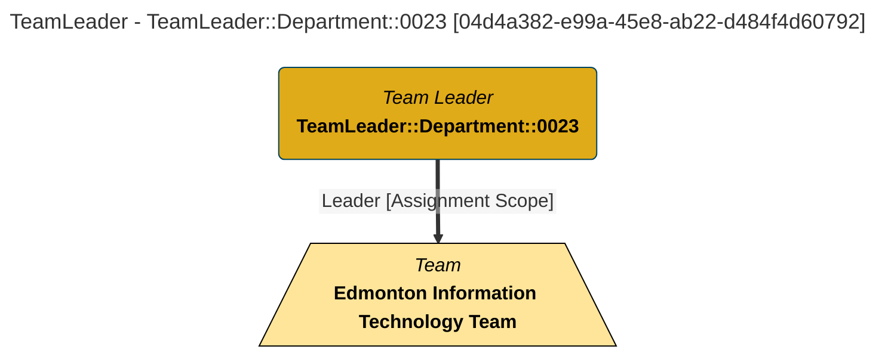

```mermaid
---
title: TeamLeader - TeamLeader::Department::0023 [04d4a382-e99a-45e8-ab22-d484f4d60792]
---
flowchart TD
%%{init: {"flowchart": {"htmlLabels": false}} }%%

1@{ shape: rounded, label: "*Team Leader*
**TeamLeader::Department::0023**"}
2@{ shape: trap-b, label: "*Team*
**Edmonton Information Technology Team**"}
1==>|"Leader [Assignment Scope]"|2
style 1 color:#000000, fill:#e0ab18, stroke:#004563
style 2 color:#000000, fill:#FFE599, stroke:#000000
```
