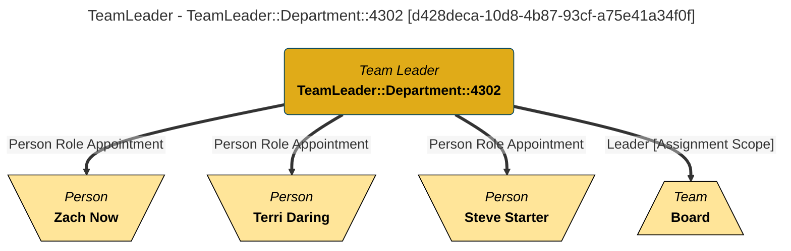

```mermaid
---
title: TeamLeader - TeamLeader::Department::4302 [d428deca-10d8-4b87-93cf-a75e41a34f0f]
---
flowchart TD
%%{init: {"flowchart": {"htmlLabels": false}} }%%

1@{ shape: rounded, label: "*Team Leader*
**TeamLeader::Department::4302**"}
2@{ shape: trap-t, label: "*Person*
**Zach Now**"}
1==>|"Person Role Appointment"|2
3@{ shape: trap-t, label: "*Person*
**Terri Daring**"}
1==>|"Person Role Appointment"|3
4@{ shape: trap-t, label: "*Person*
**Steve Starter**"}
1==>|"Person Role Appointment"|4
5@{ shape: trap-b, label: "*Team*
**Board**"}
1==>|"Leader [Assignment Scope]"|5
style 1 color:#000000, fill:#e0ab18, stroke:#004563
style 2 color:#000000, fill:#FFE599, stroke:#000000
style 3 color:#000000, fill:#FFE599, stroke:#000000
style 4 color:#000000, fill:#FFE599, stroke:#000000
style 5 color:#000000, fill:#FFE599, stroke:#000000
```
