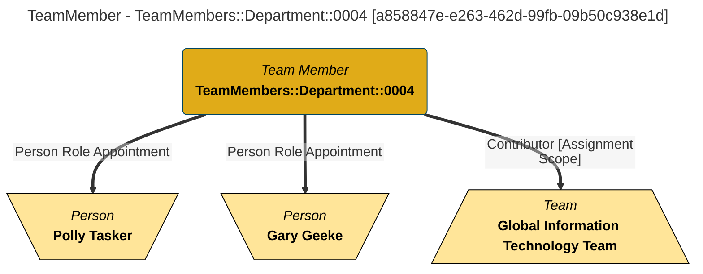

```mermaid
---
title: TeamMember - TeamMembers::Department::0004 [a858847e-e263-462d-99fb-09b50c938e1d]
---
flowchart TD
%%{init: {"flowchart": {"htmlLabels": false}} }%%

1@{ shape: rounded, label: "*Team Member*
**TeamMembers::Department::0004**"}
2@{ shape: trap-t, label: "*Person*
**Polly Tasker**"}
1==>|"Person Role Appointment"|2
3@{ shape: trap-t, label: "*Person*
**Gary Geeke**"}
1==>|"Person Role Appointment"|3
4@{ shape: trap-b, label: "*Team*
**Global Information Technology Team**"}
1==>|"Contributor [Assignment Scope]"|4
style 1 color:#000000, fill:#e0ab18, stroke:#004563
style 2 color:#000000, fill:#FFE599, stroke:#000000
style 3 color:#000000, fill:#FFE599, stroke:#000000
style 4 color:#000000, fill:#FFE599, stroke:#000000
```
