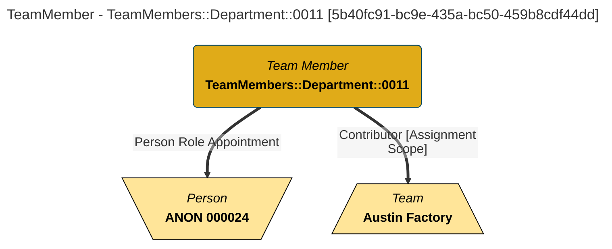

```mermaid
---
title: TeamMember - TeamMembers::Department::0011 [5b40fc91-bc9e-435a-bc50-459b8cdf44dd]
---
flowchart TD
%%{init: {"flowchart": {"htmlLabels": false}} }%%

1@{ shape: rounded, label: "*Team Member*
**TeamMembers::Department::0011**"}
2@{ shape: trap-t, label: "*Person*
**ANON 000024**"}
1==>|"Person Role Appointment"|2
3@{ shape: trap-b, label: "*Team*
**Austin Factory**"}
1==>|"Contributor [Assignment Scope]"|3
style 1 color:#000000, fill:#e0ab18, stroke:#004563
style 2 color:#000000, fill:#FFE599, stroke:#000000
style 3 color:#000000, fill:#FFE599, stroke:#000000
```
