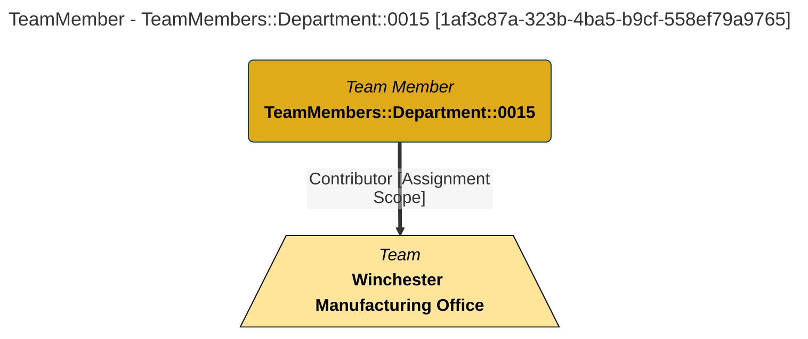

```mermaid
---
title: TeamMember - TeamMembers::Department::0015 [1af3c87a-323b-4ba5-b9cf-558ef79a9765]
---
flowchart TD
%%{init: {"flowchart": {"htmlLabels": false}} }%%

1@{ shape: rounded, label: "*Team Member*
**TeamMembers::Department::0015**"}
2@{ shape: trap-b, label: "*Team*
**Winchester Manufacturing Office**"}
1==>|"Contributor [Assignment Scope]"|2
style 1 color:#000000, fill:#e0ab18, stroke:#004563
style 2 color:#000000, fill:#FFE599, stroke:#000000
```
