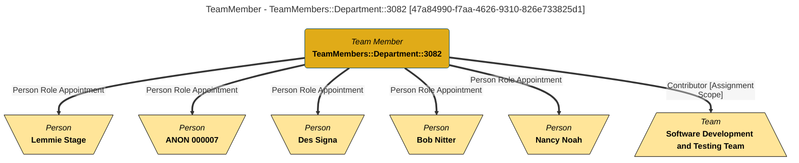

```mermaid
---
title: TeamMember - TeamMembers::Department::3082 [47a84990-f7aa-4626-9310-826e733825d1]
---
flowchart TD
%%{init: {"flowchart": {"htmlLabels": false}} }%%

1@{ shape: rounded, label: "*Team Member*
**TeamMembers::Department::3082**"}
2@{ shape: trap-t, label: "*Person*
**Lemmie Stage**"}
1==>|"Person Role Appointment"|2
3@{ shape: trap-t, label: "*Person*
**ANON 000007**"}
1==>|"Person Role Appointment"|3
4@{ shape: trap-t, label: "*Person*
**Des Signa**"}
1==>|"Person Role Appointment"|4
5@{ shape: trap-t, label: "*Person*
**Bob Nitter**"}
1==>|"Person Role Appointment"|5
6@{ shape: trap-t, label: "*Person*
**Nancy Noah**"}
1==>|"Person Role Appointment"|6
7@{ shape: trap-b, label: "*Team*
**Software Development and Testing Team**"}
1==>|"Contributor [Assignment Scope]"|7
style 1 color:#000000, fill:#e0ab18, stroke:#004563
style 2 color:#000000, fill:#FFE599, stroke:#000000
style 3 color:#000000, fill:#FFE599, stroke:#000000
style 4 color:#000000, fill:#FFE599, stroke:#000000
style 5 color:#000000, fill:#FFE599, stroke:#000000
style 6 color:#000000, fill:#FFE599, stroke:#000000
style 7 color:#000000, fill:#FFE599, stroke:#000000
```
