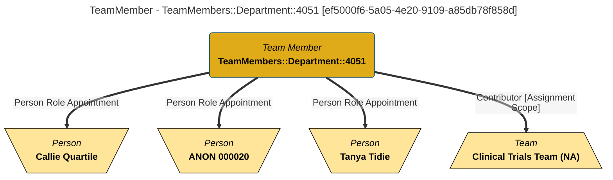

```mermaid
---
title: TeamMember - TeamMembers::Department::4051 [ef5000f6-5a05-4e20-9109-a85db78f858d]
---
flowchart TD
%%{init: {"flowchart": {"htmlLabels": false}} }%%

1@{ shape: rounded, label: "*Team Member*
**TeamMembers::Department::4051**"}
2@{ shape: trap-t, label: "*Person*
**Callie Quartile**"}
1==>|"Person Role Appointment"|2
3@{ shape: trap-t, label: "*Person*
**ANON 000020**"}
1==>|"Person Role Appointment"|3
4@{ shape: trap-t, label: "*Person*
**Tanya Tidie**"}
1==>|"Person Role Appointment"|4
5@{ shape: trap-b, label: "*Team*
**Clinical Trials Team (NA)**"}
1==>|"Contributor [Assignment Scope]"|5
style 1 color:#000000, fill:#e0ab18, stroke:#004563
style 2 color:#000000, fill:#FFE599, stroke:#000000
style 3 color:#000000, fill:#FFE599, stroke:#000000
style 4 color:#000000, fill:#FFE599, stroke:#000000
style 5 color:#000000, fill:#FFE599, stroke:#000000
```
