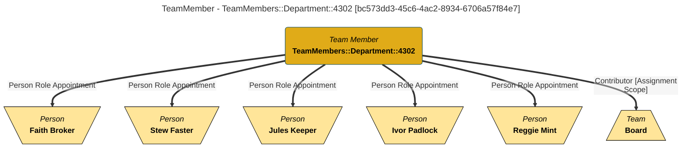

```mermaid
---
title: TeamMember - TeamMembers::Department::4302 [bc573dd3-45c6-4ac2-8934-6706a57f84e7]
---
flowchart TD
%%{init: {"flowchart": {"htmlLabels": false}} }%%

1@{ shape: rounded, label: "*Team Member*
**TeamMembers::Department::4302**"}
2@{ shape: trap-t, label: "*Person*
**Faith Broker**"}
1==>|"Person Role Appointment"|2
3@{ shape: trap-t, label: "*Person*
**Stew Faster**"}
1==>|"Person Role Appointment"|3
4@{ shape: trap-t, label: "*Person*
**Jules Keeper**"}
1==>|"Person Role Appointment"|4
5@{ shape: trap-t, label: "*Person*
**Ivor Padlock**"}
1==>|"Person Role Appointment"|5
6@{ shape: trap-t, label: "*Person*
**Reggie Mint**"}
1==>|"Person Role Appointment"|6
7@{ shape: trap-b, label: "*Team*
**Board**"}
1==>|"Contributor [Assignment Scope]"|7
style 1 color:#000000, fill:#e0ab18, stroke:#004563
style 2 color:#000000, fill:#FFE599, stroke:#000000
style 3 color:#000000, fill:#FFE599, stroke:#000000
style 4 color:#000000, fill:#FFE599, stroke:#000000
style 5 color:#000000, fill:#FFE599, stroke:#000000
style 6 color:#000000, fill:#FFE599, stroke:#000000
style 7 color:#000000, fill:#FFE599, stroke:#000000
```
