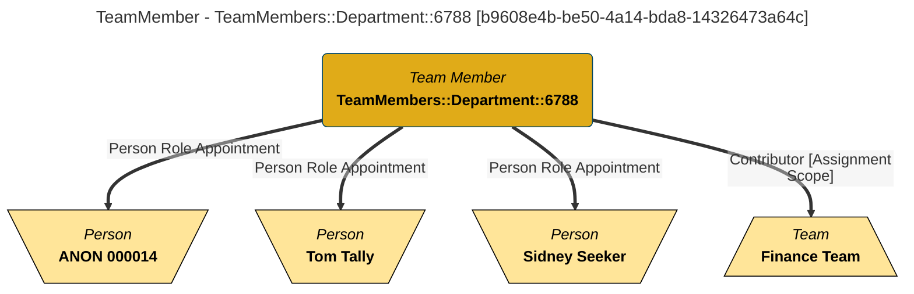

```mermaid
---
title: TeamMember - TeamMembers::Department::6788 [b9608e4b-be50-4a14-bda8-14326473a64c]
---
flowchart TD
%%{init: {"flowchart": {"htmlLabels": false}} }%%

1@{ shape: rounded, label: "*Team Member*
**TeamMembers::Department::6788**"}
2@{ shape: trap-t, label: "*Person*
**ANON 000014**"}
1==>|"Person Role Appointment"|2
3@{ shape: trap-t, label: "*Person*
**Tom Tally**"}
1==>|"Person Role Appointment"|3
4@{ shape: trap-t, label: "*Person*
**Sidney Seeker**"}
1==>|"Person Role Appointment"|4
5@{ shape: trap-b, label: "*Team*
**Finance Team**"}
1==>|"Contributor [Assignment Scope]"|5
style 1 color:#000000, fill:#e0ab18, stroke:#004563
style 2 color:#000000, fill:#FFE599, stroke:#000000
style 3 color:#000000, fill:#FFE599, stroke:#000000
style 4 color:#000000, fill:#FFE599, stroke:#000000
style 5 color:#000000, fill:#FFE599, stroke:#000000
```
