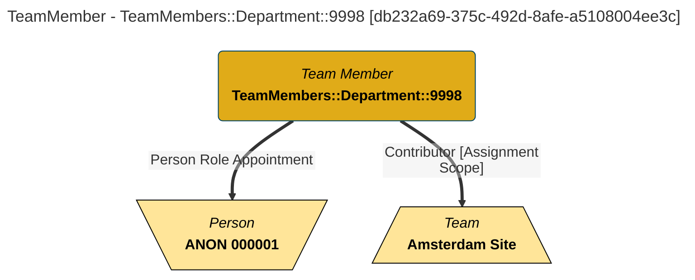

```mermaid
---
title: TeamMember - TeamMembers::Department::9998 [db232a69-375c-492d-8afe-a5108004ee3c]
---
flowchart TD
%%{init: {"flowchart": {"htmlLabels": false}} }%%

1@{ shape: rounded, label: "*Team Member*
**TeamMembers::Department::9998**"}
2@{ shape: trap-t, label: "*Person*
**ANON 000001**"}
1==>|"Person Role Appointment"|2
3@{ shape: trap-b, label: "*Team*
**Amsterdam Site**"}
1==>|"Contributor [Assignment Scope]"|3
style 1 color:#000000, fill:#e0ab18, stroke:#004563
style 2 color:#000000, fill:#FFE599, stroke:#000000
style 3 color:#000000, fill:#FFE599, stroke:#000000
```
