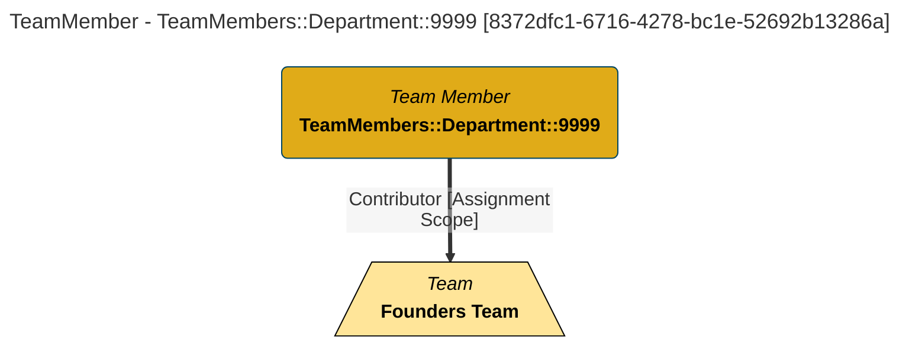

```mermaid
---
title: TeamMember - TeamMembers::Department::9999 [8372dfc1-6716-4278-bc1e-52692b13286a]
---
flowchart TD
%%{init: {"flowchart": {"htmlLabels": false}} }%%

1@{ shape: rounded, label: "*Team Member*
**TeamMembers::Department::9999**"}
2@{ shape: trap-b, label: "*Team*
**Founders Team**"}
1==>|"Contributor [Assignment Scope]"|2
style 1 color:#000000, fill:#e0ab18, stroke:#004563
style 2 color:#000000, fill:#FFE599, stroke:#000000
```
