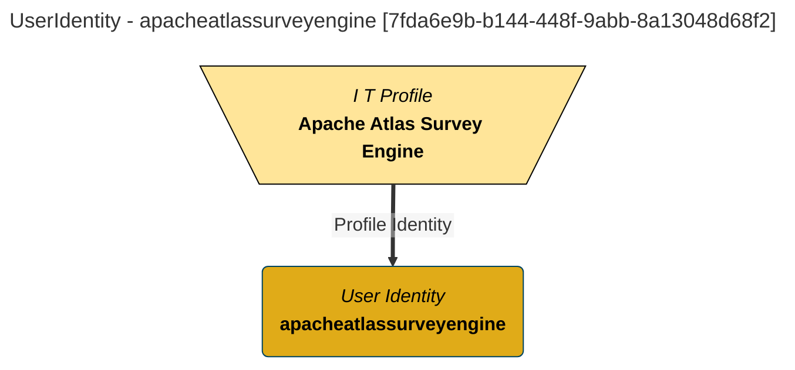

```mermaid
---
title: UserIdentity - apacheatlassurveyengine [7fda6e9b-b144-448f-9abb-8a13048d68f2]
---
flowchart TD
%%{init: {"flowchart": {"htmlLabels": false}} }%%

1@{ shape: rounded, label: "*User Identity*
**apacheatlassurveyengine**"}
2@{ shape: trap-t, label: "*I T Profile*
**Apache Atlas Survey Engine**"}
2==>|"Profile Identity"|1
style 1 color:#000000, fill:#e0ab18, stroke:#004563
style 2 color:#000000, fill:#FFE599, stroke:#000000
```
