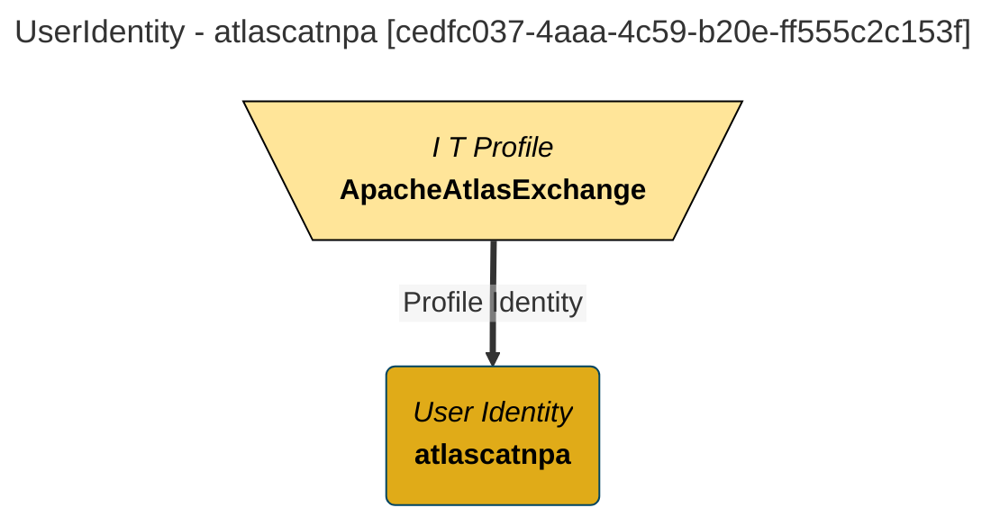

```mermaid
---
title: UserIdentity - atlascatnpa [cedfc037-4aaa-4c59-b20e-ff555c2c153f]
---
flowchart TD
%%{init: {"flowchart": {"htmlLabels": false}} }%%

1@{ shape: rounded, label: "*User Identity*
**atlascatnpa**"}
2@{ shape: trap-t, label: "*I T Profile*
**ApacheAtlasExchange**"}
2==>|"Profile Identity"|1
style 1 color:#000000, fill:#e0ab18, stroke:#004563
style 2 color:#000000, fill:#FFE599, stroke:#000000
```
